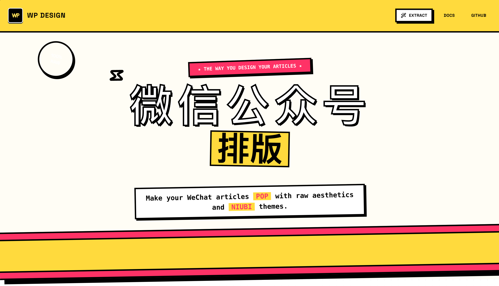

<div align="center">
  
  <h1>Pixel Lab - WeChat Formatter</h1>
  <p><strong>一款由 AI 驱动的微信公众号 Markdown 格式化排版神器</strong></p>
  <p>
    
    
    
    
  </p>
</div>

---

## 🌟 项目简介

**Pixel Lab** 是一款专为微信公众号创作者打造的 Markdown 编辑器。它不仅能将 Markdown 转换为符合微信公众号渲染规则的 HTML（包含安全的内联样式），还引入了创新的 **AI 主题提取** 功能。

你可以从任何精美的网页中“克隆”其视觉风格，让 AI 自动分析、提取并生成一套完整的微信排版主题。

---

## ✨ 核心特性

- 🚀 **AI 主题克隆**：只需上传或粘贴你喜欢的网页 HTML，AI (Kimi K2) 即可自动提取其字体、配色、边框、间距等样式，生成专属主题。
- 📱 **实时双屏预览**：支持手机（Mobile）与桌面（PC）双视图实时预览，确保排版在任何设备上都完美呈现。
- 🎨 **极简 Neo-brutalism UI**：采用现代、大胆的新野兽派设计风格，操作流程更直观。
- 🛠️ **高度可定制**：基于 JSON 的主题引擎，每个区块（标题、正文、代码、引用等）均可深度定义。
- 📎 **一键复制**：一键生成符合微信后台规则的代码，直接粘贴，格式不乱。

---

## 📸 界面预览

### 1. 编辑与预览主界面
> 这里需要一张展示左侧编辑器和右侧实时预览（手机模型）的完整截图。


### 2. AI 主题提取工作流
> 这里需要一张展示用户上传 HTML 并由 AI 提取、生成样式的动画或截图。


### 3. 多端预览模式
> 这里展示手机视角与 PC 视角切换的效果。


---

## 🛠️ 技术栈

- **前端框架**: [React 19](https://react.dev/)
- **构建工具**: [Vite 6](https://vitejs.dev/)
- **样式方案**: [Tailwind CSS 4](https://tailwindcss.com/) & Inline Styles
- **动画库**: [Framer Motion](https://www.framer.com/motion/)
- **Markdown 解析**: [react-markdown](https://github.com/remarkjs/react-markdown)
- **AI 能力**: [Moonshot AI (Kimi-K2)](https://www.moonshot.cn/)

---

## 🚀 快速上手

### 1. 克隆项目
```bash
git clone https://github.com/vincent19951222/wpdesign.git
cd wpdesign
```

### 2. 安装依赖
```bash
npm install
```

### 3. 配置环境变量
在项目根目录创建 `.env.local` 文件，并填入你的 Kimi API Key：
```env
VITE_MOONSHOT_API_KEY=你的_MOONSHOT_API_KEY
```

### 4. 启动开发服务器
```bash
npm run dev
```
打开浏览器访问 `http://localhost:5173` 即可开始创作。

---

## 🧠 如何使用 AI 主题提取

1. **寻找灵感**：找到一个你觉得排版非常好看的网页（如其他优秀的公众号文章）。
2. **获取 HTML**：通过浏览器的“检查元素”或“查看网页源代码”，复制你想借鉴的部分或整个页面的 HTML。
3. **AI 智能提取**：由于项目中集成了主题提取模块，点击“AI 提取”按钮，粘贴 HTML。
4. **即刻使用**：AI (Kimi K2) 会在几秒钟内分析样式并应用到编辑器中，你可以立即看到你的 Markdown 变成了同样的风格。

---

## 📄 开源协议

本项目采用 [MIT License](LICENSE) 开源。

---

## 🤝 贡献建议

欢迎提交 Issue 或 Pull Request！我们非常期待看到更多有趣的主题预设。

---

<div align="center">
  <p>Made with ❤️ by Pixel Lab Team</p>
</div>

